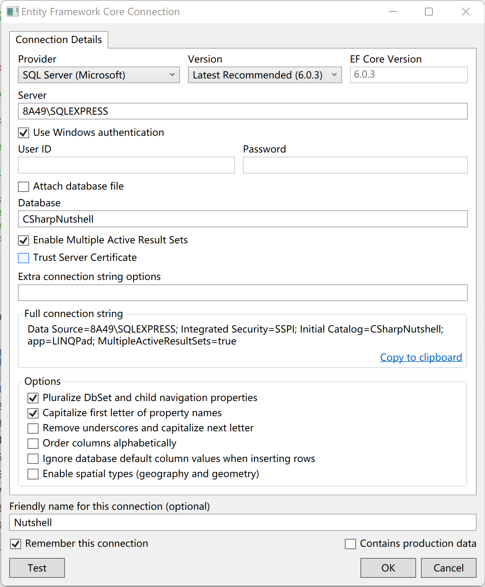
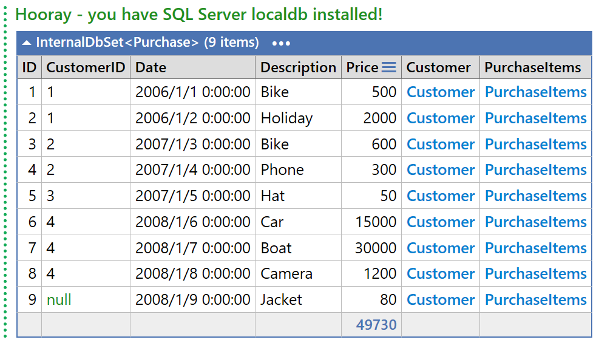

# C# 10 in a Nutshell

## 在 LINQPad 中使用数据库

1. 下载安装 SQL Express 、SSMS ．
2. 打开 SSMS ，创建一个新数据库，比如 CSharpNutshell ．
3. 右键左上角的 Nutshell ，选择 Properties ．

  

4. 执行 Readme.Second()
5. 刷新 Nutshell
6. 执行 Readme．first()

  
